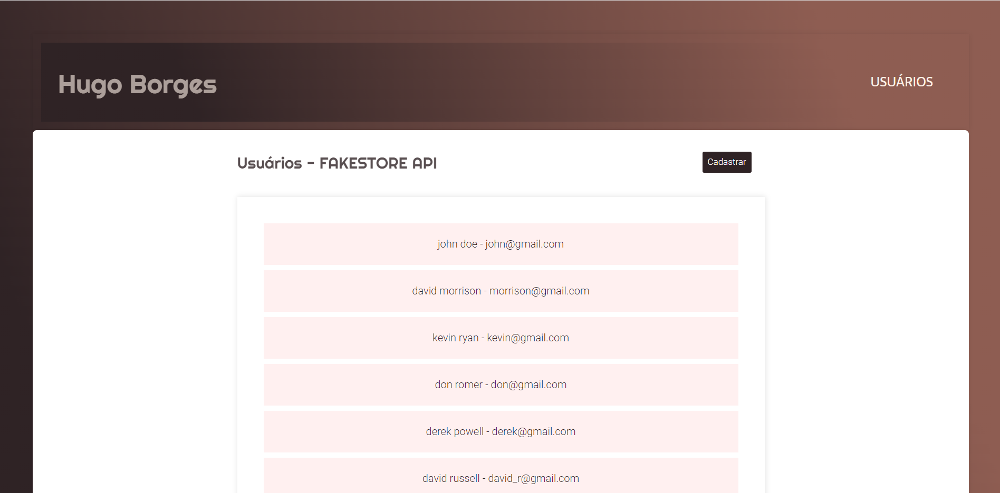

# Aplicação CRUD de Usuários em REACT utilizando Fakestore API
+


## Introdução
Olá! 👋

Obrigado por conferir minha solução para o teste de aplicação CRUD em REACT. 😀

Sinta-se à vontade para explorar! 😉

## Visão Geral

Para este teste, utilizei...

JavaScript
React
ReactDom
CSS
SCSS
AppRouter
Axios

## Descrição do projeto

O projeto é uma aplicação CRUD de usuários em React utilizando a API Fakestoreapi

Requisitos da atividade:
- ReactJS
- Redux
- Typescript

Telas:
- Lista de usuários
- Cadastro de usuário
- Edição de usuário
- Deletar usuário

## Como instalar e utilizar:

Para testar o projeto, execute, no diretório raiz, os seguintes comandos:

```javascript
npm i
npm start
```

Happy coding! 😀
